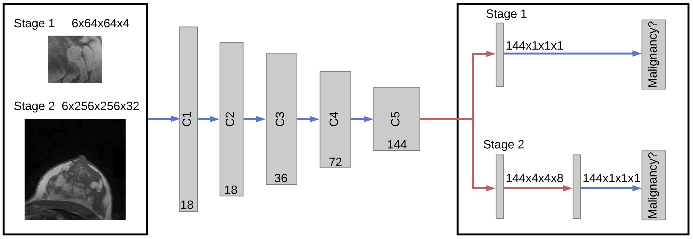

# Multi Scale Curriculum CNN for Context-Aware Breast MRI Malignancy Classification

Code for our paper *Multi Scale Curriculum CNN for Context-Aware Breast MRI Malignancy Classification* accepted for oral presentation at [MICCAI 2019](https://www.miccai2019.org).



## Installation
This repository has been tested with Ubuntu 18.04 and macOS 10.14 Mojave, we highly recommend using a dedicated GPU though.

### Editable Installation
```
git clone https://github.com/haarburger/multi-scale-curriculum.git .
cd multi-scale-curriculum
pip install -e .
```
### Installation
```
pip install git+https://github.com/haarburger/multi-scale-curriculum.git
```

## Getting Started

A toy example is provided in `experiments/example`.
This folder contains a script and config file for stage 1 and stage 2.
You may want to change the folder to which the generated data is saved in `experiments/exmple/generate_data.py` and the location for the files generated during training in `experiments/example/patch.yml` and `experiments/example/wic.yml`. Note that you need to train stage 1 and load the corresponding model during stage 2.

The specific steps are as follows:

```bash
# generate dummy data
python experiments/example/generate_data.py

# train stage 1 (3D "patches")
python experiments/example/exec_patch.py -cp experiments/example/patch.yml

# update pretrained model path from the previous step in experiments/example/wic.yml

# train stage 2 (3D volumes)
python experiments/example/exec_wic.py -cp experiments/example/wic.yml
```

## Citation

If you use our work, please cite our paper as follows
```tex
@inproceedings{haarburger_2019,
    Author = {Christoph Haarburger and Michael Baumgartner and Daniel Truhn and Mirjam Broeckmann and Hannah Schneider and Simone Schrading and Christiane Kuhl and Dorit Merhof},
    Booktitle = {Medical Image Computing and Computer Assisted Intervention (MICCAI)},
    Title = {Multi Scale Curriculum CNN for Context-Aware Breast MRI Malignancy Classification},
    Year = {2019}}
```
